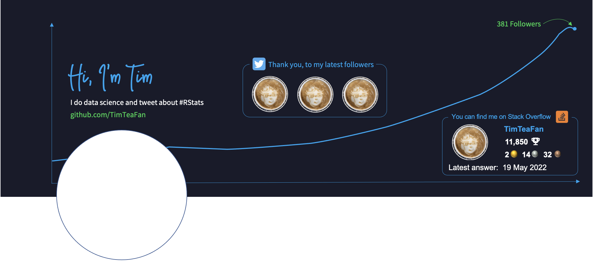

<!-- README.md is generated from README.Rmd. Please edit that file -->

# Dynamic Twitter Profile Banner (Header Image)

<!-- badges: start -->

<!-- badges: end -->

## About

This repo contains scripts and files that automatically create and
update the Twitter profile banner (also know as “header image”) of my
main Twitter account [@TimTeaFan](https://twitter.com/TimTeaFan). The
profile banner shows:

1.  the number of my Twitter followers over time up to the current month
2.  the profile pictures of my latest three followers
3.  some current data of my Stack Overflow account (reputation, medals,
    and date of most recent answer)

The most essential parts are:

- the [R script](/R/update_banner.R) that gets data from Twitter and
  Stack Overflow, and then adds this data together with some template
  images together to build the final profile banner.
- the [python script](/python/upload_banner.py) that uploads the profile
  banner to Twitter.
- the [YAML script](/.github/workflows/update_banner.yaml) that
  automates the workflow using Github Actions.
- the [Dockerfile](Dockerfile) which was used to create the Docker Hub
  repository
  [timteafan/pymar](https://hub.docker.com/repository/docker/timteafan/pymar).
  This docker image contains all packages and system libraries which are
  needed for the job run.

The remainder of this README elaborates on each of those parts. This
helps me remember the workarounds that were necessary to make this
project work, and it might also help other readers to build something
similar. If you build upon this code, let me know in case you make any
improvements to it, especially in case you figure out how to upload the
profile banner from within R (more on that below).

## Idea & History

For some time I wanted to get acquainted with the Twitter API and the
{rtweet} package. I came up with several projects and creating a dynamic
profile banner was one of them (for my other Twitter-related projects
see the [rstatspkgbot](https://github.com/TimTeaFan/rstatspkgbot) and
the Twitter Like Badge implemented in the [README of the {loopurrr}
package](https://github.com/TimTeaFan/loopurrr)).

Dynamic Twitter profile banners have been trending since 2021,
especially within the web developer community where people often use PHP
or node.js (see for example
[here](https://daily-dev-tips.com/posts/how-i-made-my-twitter-header-dynamic/)).
The idea to create a dynamic profile banner in R seemed particularly
appealing, since R has a rich ecosystem which makes interacting with
APIs, creating graphs and editing images comparatively easy.
Nevertheless, not many in the \#RStats community are actually using a
dynamic profile banner, which made me wonder: is this project exploring
a real niche or are there any stumbling stones which prevent R users
from using a dynamic profile banner? (we will come back to that below)

## Setup

Below I describe the setup of this project step by step focussing on
those parts which were not so obvious or caused me some trouble to
implement.

#### Concept and Setup

I started by creating a rough draft of how I wanted my future banner
profile to look like. This was important to understand which parts of
the image were static and wouldn’t change and over time and which parts
were dynamic and would be updated using external data.

I wanted to show a plot in the background with the number of followers
over time, a box showing the profile pictures of my last three followers
and a box containing some current data of my Stack Overflow profile.

Draft of final banner image made in PowerPoint: 

Once this was set, I created template images of the static parts using
PowerPoint and [Pixelmator Classic](https://www.pixelmator.com/mac/).
This is how they look like:

The initial background image: 

A box which will show the latest followers: 

A box which will show some current data from Stack Overflow: 

#### Getting data and adding it to the final profile banner image

After figuring out how the final banner should look like, and after
creating the static parts, I started writing an [R
script](/R/update_banner.R) that:

1.  downloaded the necessary data from Twitter and Stack Overflow,
2.  created a ggplot showing the number of followers over time, and
3.  pieced all the parts together into one final banner using the
    {magick} package.

Writing this script was pretty straight-forward. {httr2} and {rtweet}
make it easy to get data from the Twitter and Stack Overflow API. I’m
somewhat acquainted with {ggplot2}, but I don’t use it in my daily work,
so creating a plot from scratch was fun, but also took me some fiddling
around. I really appreciate that {ggplot2} is not only well documented,
it is also very “google-able” (if that is even a word). Finally piecing
the images together with the {magick} package worked fairly well. Most
of the things I needed were described in [this
vignette](https://cran.r-project.org/web/packages/magick/vignettes/intro.html).
The only part which was tripping me up, was cropping the profile
pictures of my latest three followers in form of a circle. It is easy to
get the URL of the profile pictures with {rtweet}, but when downloading
the images most of them are square so they need to be “circle cropped”.
Looking at [this answer](https://stackoverflow.com/a/40069492/9349302)
on Stack Overflow was really helpful to solve this issue.

#### Uploading to Twitter

After writing this script, I ran it locally and things were totally
working out. I was almost there. I thought, I’d just needed to add a
line to upload the final image to Twitter and would be done. That’s when
a rabbit whole opened up.

It turned out that the {rtweet} package doesn’t have a function to
update ones profile banner. So the first thought was to look at an
existing function, such as `rtweet::post_tweet()`, adapt its code and
create a new function that would interact with the
`update_profile_banner` API endpoint.

Because this attempt was generating weird error messages, I decided to
use `curl` directly from within R with a call to `system2()`. However,
here the problem was that I needed to create an OAUTH signature. Which I
tried in many ways, but to no avail.

I posted two (of my many) attempts to get this endpoint working from
within R on [Stack
Overflow](https://stackoverflow.com/questions/72652028/twitter-api-v1-1-update-profile-banner-from-within-r),
even put a bounty on it, but the issue is still unsolved.

Lluís Revilla, one of the maintainers of the {rtweet} package, was so
kind to open [an issue](https://github.com/ropensci/rtweet/issues/715)
and look into this, but apparently, the problem persists.

Since this was going nowhere, the easy way out was to use the python
{tweepy} package for the uploading part. Although it would have been
nice to do everything from within R (just because nobody yet has), using
a [python script](/python/upload_banner.py) here was a valid (and very
easy) alternative.

#### Building a container

I read in Cara Thompson’s [blog post on the
artfulbot](https://www.cararthompson.com/posts/2021-09-10-setting-up-the-artfulbot/)
about the idea to create a custom docker container for the Github Action
job run. Since I wanted to get deeper into docker, this was a good
opportunity to do so. Further, this would also positively affect the run
time of the workflow by avoiding the installation of necessary packages
in each run.

I started building the [dockerfile](Dockerfile) from the
[`rocker/tidyverse`](https://hub.docker.com/r/rocker/tidyverse) repo. On
top of this I installed python and pip together with other system
dependencies. After that I added two requirement files containing the
necessary R and python packages which could be installed by just running
both scripts. I noticed that packages like {dplyr} and {ggplot2} were
installed again, although the `rocker/tidyverse` repo already contains
them. To avoid this I added an `.Renviron` file pointing the lib path to
`/usr/lib/R/site-library`. After this, already installed packages were
not installed a second time.

Finally, {magick} needed some system dependencies to run, and while
googling this, I stumbled upon [this similar
question](https://stackoverflow.com/questions/51940792/r-cairo-package-installation-failed-in-ubuntu-18-04)
on Stack Overflow where Dirk Eddelbuettel points to the [website of the
R Debian package maintainers](https://salsa.debian.org/r-pkg-team). This
allows us to install the {magick} package *with all its system
dependencies* just by adding `sudo apt install r-cran-magick -y` to the
dockerfile.

For some reason, calling `library(magick)` threw the error that it needs
to be installed again, since the installed version was built before R
4.0. So I added “magick” to the package list in requirements.R and the
error didn’t show again.

After building the docker image I pushed it to a repo
[timteafan/pymar](https://hub.docker.com/r/timteafan/pymar) (which
stands for PYthon, MAgick, and R), where it can be used for similar job
runs.

Once I had the docker image, I spun up a container and loaded the
necessary libraries locally to check for any problems. No errors popped
up, so I stopped testing here, although this would have been a good
chance to run the whole workflow one time locally in the container.

#### Automating with GitHub Actions

The last challenge was to get the scripts running in the container
inside a GitHub Action workflow.

I had been using GitHub Actions for several projects in the past, but up
to now, I hadn’t used a docker container for the job run. The part I was
most worried about, was what the container can “see”. Locally we can
mount volumes on the container which connect specific folder on the
container and its host. In GitHub Action I was not sure if this was
necessary. It turned out, that it was. We can just add the container and
use `actions/checkout` as usual and the scripts inside the container
will see (and can access) all files in the repo.

The final challenge was to push changes in the container back to the
repo. This was indeed a challenge, since calling `git config` in the
container always threw the error `fatal: not a git repository`. Checking
the container locally showed that git was installed, and that it was
also included in `PATH`. After a lot of googling a viable lead was to
add `git config --global --add safe.directory "$GITHUB_WORKSPACE"`
before any other git commands - and this indeed did the trick. However,
I’m still not sure if this is a solution to a valid problem, or whether
this is just a workaround for a problem that wouldn’t arise with a
better setup.

After that, pushing the updated banner profile image back to the repo
worked, and this was the last piece to the puzzle. Now the job runs
every three hours and it takes not more than one minute to complete.

## Acknowledgements

This projects is building on many packages, answers and ideas. If I had
to name a few, I’d send out credit to the creators and maintainers of
the {rtweet} and the {magick} package, since a big part of the project
relies on those two packages.

Further, [this answer](https://stackoverflow.com/a/40069492/9349302) on
Stack Overflow helped a lot with “circle cropping” profile images.

Finally credit goes to the [R Debian package
maintainers](https://salsa.debian.org/r-pkg-team).

## Disclaimer

While I encourage others to fork this repo and copy this approach to
dynamically update their Twitter profile banner, please keep in mind
that this repo comes with no guarantees whatsoever. If you find a bug or
if you make any improvements, let me know by filing an issue!
